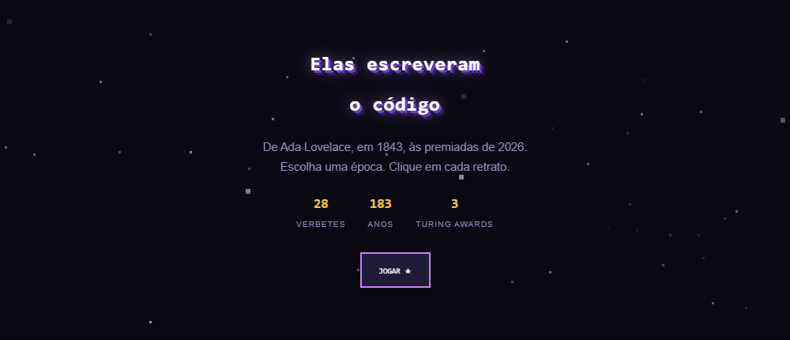
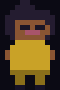

<div align="center">



   

### Uma linha do tempo em pixel art sobre mulheres que mudaram a computação.

[ABRIR A LINHA DO TEMPO](https://ptautz.github.io/she-runs/) &nbsp;|&nbsp; [JOGAR SHE RUNS](https://ptautz.github.io/she-runs/game.html)

`1843 - 2026` &nbsp; `28 VERBETES` &nbsp; `5 ERAS` &nbsp; `PIXEL ART POR CÓDIGO`

</div>

---

> De Ada Lovelace, em 1843, às pesquisadoras e inovadoras premiadas em 2026.
> Escolha uma época. Clique em cada retrato. Siga as fontes.

`Elas escreveram o código` é uma página estática e interativa sobre mulheres na computação. Cada verbete situa um feito no tempo, com texto autoral, fonte principal e um retrato pixel art gerado no próprio navegador.

## [ 01. A LINHA DO TEMPO ]

| ERA | PERÍODO | O QUE ENCONTRAR |
| :-- | :-- | :-- |
| `PIONEIRAS` | 1843 - 1946 | Algoritmos antes dos computadores eletrônicos. |
| `ERA NASA` | 1949 - 1978 | Computadoras humanas, programação e corrida espacial. |
| `ERA DIGITAL` | 1980 - 2005 | Internet, interfaces e infraestrutura. |
| `ERA DA IA` | 2009 - 2019 | Dados, visão computacional e ética algorítmica. |
| `AGORA` | 2025 - 2026 | Pesquisadoras, inovadoras e o placar atual. |

Os anos mostram o ano do feito, não a data de nascimento. Em uma linha do tempo, o que importa aqui é quando a contribuição aconteceu.

## [ 02. COMO FOI FEITO ]

```text
HTML + CSS + JavaScript puro
sem framework
sem etapa de build
```

- A linha do tempo vive em [`index.html`](index.html).
- O jogo de plataforma vive em [`game.html`](game.html).
- Os retratos não são fotografias: são SVGs montados por JavaScript a partir de grades de caracteres `12 x 13`.
- O fundo estrelado e animado em `canvas`.
- Cada verbete traz um link para sua fonte principal.

## [ 03. RODAR LOCALMENTE ]

Não é preciso instalar dependências. Abra [`index.html`](index.html) no navegador ou sirva a pasta:

```bash
python3 -m http.server 8000
```

Depois, abra `http://localhost:8000`.

## [ 04. PUBLICAÇÃO ]

O projeto está preparado para GitHub Pages. Em um repositório já enviado ao GitHub, configure **Settings > Pages** para publicar a branch `main` a partir de `/(root)`.

O arquivo [`.nojekyll`](.nojekyll) garante que os arquivos estáticos sejam servidos sem processamento do Jekyll.

## [ 05. PLACAR DO JOGO ]

O placar global de [`game.html`](game.html) usa um Cloudflare Worker com KV. O código fica em [`backend/worker.js`](backend/worker.js).

```bash
npx wrangler login
npx wrangler kv namespace create "SHE_RUNS_SCORES"
npx wrangler secret put SECRET_SALT
npx wrangler deploy
```

Depois do deploy, coloque a URL retornada na constante `WORKER_URL` em [`game.html`](game.html). Para conferir o placar vazio ou publicado:

```bash
curl https://she-runs-worker.SEUNOME.workers.dev/scores/top10
```

## [ 06. FONTES E CORREÇÕES ]

As fontes aparecem em cada verbete. As referências incluem, entre outras, NASA History Office, ACM Awards, Computer History Museum, Japan Prize Foundation, Comissão Europeia e Internet Hall of Fame.

Dados de 2025 e 2026 foram verificados em fontes primárias em agosto de 2026. Encontrou erro de data, atribuição ou contexto? Abra uma issue: uma linha do tempo histórica precisa continuar sendo revisada.

## [ LICENÇA ]

Código sob licença MIT. Os textos biográficos são de autoria do projeto, redigidos a partir das fontes linkadas em cada verbete.
